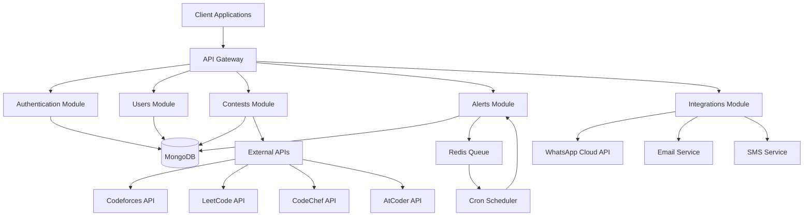

# 📚 CodeNotify API Overview

## Introduction

Welcome to the CodeNotify API documentation! This comprehensive guide provides an overview of all available APIs, their current implementation status, and how they work together to create a powerful contest notification system.

## 🏗️ System Architecture



## 📋 API Modules Overview

| Module | Status | Base URL | Description | Documentation |
|--------|--------|----------|-------------|---------------|
| **Authentication** | ✅ Complete | `/auth` | JWT-based authentication system | [AUTH.md](./AUTH.md) |
| **Users** | ✅ Complete | `/users` | User management and profiles | [USERS.md](./USERS.md) |
| **Contests** | 🚧 In Progress | `/contests` | Contest data and management | [CONTESTS.md](./CONTESTS.md) |
| **Alerts** | 🚧 In Progress | `/alerts` | Notification and alert system | [ALERTS.md](./ALERTS.md) |
| **Integrations** | 🚧 In Progress | `/integrations` | External service integrations | [INTEGRATIONS.md](./INTEGRATIONS.md) |

## 🔐 Authentication Flow

All API endpoints (except authentication endpoints) require JWT authentication:

```bash
# 1. Register or login to get tokens
curl -X POST http://localhost:3000/auth/signin \
  -H "Content-Type: application/json" \
  -d '{"email":"user@example.com","password":"password123"}'

# Response includes accessToken and refreshToken
{
  "user": {...},
  "accessToken": "eyJhbGciOiJIUzI1NiIsInR5cCI6IkpXVCJ9...",
  "refreshToken": "eyJhbGciOiJIUzI1NiIsInR5cCI6IkpXVCJ9..."
}

# 2. Use accessToken for authenticated requests
curl -X GET http://localhost:3000/users/profile \
  -H "Authorization: Bearer YOUR_ACCESS_TOKEN"
```

## 🚀 Quick Start Guide

### 1. Setup and Installation

```bash
# Clone the repository
git clone https://github.com/YashKumarSingh3053/CodeNotify.git
cd CodeNotify/backend

# Install dependencies
npm install

# Setup environment
cp .env.example .env
# Edit .env with your configuration

# Start the application
npm run start:dev
```

### 2. Create Your First User

```bash
curl -X POST http://localhost:3000/auth/signup \
  -H "Content-Type: application/json" \
  -d '{
    "email": "developer@example.com",
    "password": "securePassword123",
    "name": "Developer User",
    "phoneNumber": "+1234567890"
  }'
```

### 3. Update User Preferences

```bash
curl -X PUT http://localhost:3000/users/profile \
  -H "Authorization: Bearer YOUR_ACCESS_TOKEN" \
  -H "Content-Type: application/json" \
  -d '{
    "preferences": {
      "platforms": ["codeforces", "leetcode"],
      "alertFrequency": "immediate",
      "contestTypes": ["div2", "weekly"]
    }
  }'
```

## 📊 API Status Dashboard

### ✅ Fully Implemented APIs

#### Authentication API
- **Endpoints**: 4/4 complete
- **Features**: JWT auth, refresh tokens, password hashing
- **Test Coverage**: 21 test cases (AuthService: 13, AuthController: 8)
- **Security**: bcrypt, input validation, error handling

#### Users API  
- **Endpoints**: 5/5 complete
- **Features**: Profile management, preferences, account status
- **Test Coverage**: 32 test cases (UsersService: 18, UsersController: 14)
- **Security**: Protected routes, data validation

### 🚧 In Development APIs

#### Contests API
- **Status**: Module structure complete, implementation in progress
- **Planned Endpoints**: 8 endpoints
- **Features**: Multi-platform contest data, filtering, search
- **Integration**: Codeforces, LeetCode, CodeChef, AtCoder

#### Alerts API
- **Status**: Module structure complete, implementation in progress  
- **Planned Endpoints**: 9 endpoints
- **Features**: Smart scheduling, multi-channel delivery, templates
- **Integration**: WhatsApp, Email, SMS notifications

#### Integrations API
- **Status**: Module structure complete, implementation in progress
- **Planned Endpoints**: 12 endpoints  
- **Features**: WhatsApp, Email, SMS, unified notifications
- **Integration**: Meta WhatsApp API, SendGrid, Twilio

## 🔗 API Relationships

### Data Flow Between Modules

1. **User Registration** (Auth) → **User Profile** (Users)
2. **Contest Data** (Contests) → **Alert Creation** (Alerts)
3. **Alert Scheduling** (Alerts) → **Notification Delivery** (Integrations)
4. **User Preferences** (Users) → **Alert Filtering** (Alerts)

### Cross-Module Dependencies

```typescript
// Example: Creating a contest alert
const user = await usersService.findById(userId);
const contest = await contestsService.findById(contestId);
const alert = await alertsService.createAlert({
  userId: user.id,
  contestId: contest.id,
  type: 'contest_starting_soon',
  scheduledAt: contest.startTime - user.preferences.reminderMinutes * 60000
});
await integrationsService.scheduleNotification(alert);
```

## 📝 Request/Response Patterns

### Standard Response Format

```typescript
// Success Response
{
  "data": {...},
  "message": "Operation successful",
  "timestamp": "2023-09-06T10:30:00.000Z"
}

// Error Response
{
  "error": "ERROR_CODE",
  "message": "Human readable error message",
  "details": {...},
  "timestamp": "2023-09-06T10:30:00.000Z"
}

// Validation Error Response
{
  "error": "VALIDATION_ERROR",
  "message": "Validation failed",
  "errors": [
    {
      "field": "email",
      "message": "Invalid email format"
    }
  ],
  "timestamp": "2023-09-06T10:30:00.000Z"
}
```

### Pagination Pattern

```typescript
// Paginated Request
GET /contests?page=1&limit=20&platform=codeforces

// Paginated Response
{
  "data": [...],
  "pagination": {
    "page": 1,
    "limit": 20,
    "total": 150,
    "totalPages": 8,
    "hasNext": true,
    "hasPrev": false
  }
}
```

## 🔧 Common Headers

### Required Headers
```bash
# For authenticated requests
Authorization: Bearer <access_token>

# For POST/PUT requests
Content-Type: application/json

# Optional: Request ID for tracking
X-Request-ID: unique-request-id
```

### Response Headers
```bash
# API version
X-API-Version: 1.0.0

# Rate limiting info
X-RateLimit-Limit: 1000
X-RateLimit-Remaining: 999
X-RateLimit-Reset: 1694001600

# Request processing time
X-Response-Time: 150ms
```

## 🚨 Error Codes Reference

### Authentication Errors (4xx)
- `AUTH_REQUIRED` (401): Missing or invalid authentication
- `TOKEN_EXPIRED` (401): Access token has expired
- `REFRESH_TOKEN_INVALID` (401): Invalid refresh token
- `ACCOUNT_DEACTIVATED` (403): User account is deactivated

### Validation Errors (4xx)
- `VALIDATION_ERROR` (400): Input validation failed
- `INVALID_EMAIL` (400): Email format is invalid
- `PASSWORD_TOO_WEAK` (400): Password doesn't meet requirements
- `USER_NOT_FOUND` (404): Requested user doesn't exist

### Server Errors (5xx)
- `INTERNAL_ERROR` (500): Unexpected server error
- `DATABASE_ERROR` (500): Database operation failed
- `EXTERNAL_API_ERROR` (502): External service unavailable
- `RATE_LIMIT_EXCEEDED` (429): Too many requests

## 📈 Rate Limiting

### Current Limits
- **Authentication endpoints**: 10 requests/minute per IP
- **User endpoints**: 100 requests/minute per user
- **Contest endpoints**: 200 requests/minute per user (planned)
- **Alert endpoints**: 50 requests/minute per user (planned)

### Rate Limit Headers
```bash
X-RateLimit-Limit: 100
X-RateLimit-Remaining: 95
X-RateLimit-Reset: 1694001600
Retry-After: 60  # When rate limited
```

## 🧪 Testing the APIs

### Using cURL

```bash
# Test authentication
curl -X POST http://localhost:3000/auth/signup \
  -H "Content-Type: application/json" \
  -d '{"email":"test@example.com","password":"test123","name":"Test User"}'

# Test protected endpoint
curl -X GET http://localhost:3000/users/profile \
  -H "Authorization: Bearer YOUR_TOKEN"
```

### Using Postman

1. Import the Postman collection (coming soon)
2. Set environment variables for base URL and tokens
3. Run the authentication flow
4. Test other endpoints with automatic token management

### Using JavaScript/TypeScript

```typescript
// Example API client
class CodeNotifyAPI {
  private baseURL = 'http://localhost:3000';
  private accessToken: string;

  async authenticate(email: string, password: string) {
    const response = await fetch(`${this.baseURL}/auth/signin`, {
      method: 'POST',
      headers: { 'Content-Type': 'application/json' },
      body: JSON.stringify({ email, password })
    });
    const data = await response.json();
    this.accessToken = data.accessToken;
    return data;
  }

  async getProfile() {
    const response = await fetch(`${this.baseURL}/users/profile`, {
      headers: { 'Authorization': `Bearer ${this.accessToken}` }
    });
    return response.json();
  }
}
```

## 🔄 API Versioning

### Current Version
- **Version**: v1.0.0
- **Base URL**: `http://localhost:3000`
- **Versioning Strategy**: URL path versioning (planned for v2)

### Future Versioning
```bash
# Planned versioning structure
http://localhost:3000/v1/auth/signin
http://localhost:3000/v2/auth/signin
```

## 📊 Monitoring and Analytics

### Health Check Endpoint
```bash
GET /health

# Response
{
  "status": "healthy",
  "timestamp": "2023-09-06T10:30:00.000Z",
  "uptime": 3600,
  "version": "1.0.0",
  "services": {
    "database": "healthy",
    "redis": "healthy",
    "external_apis": "healthy"
  }
}
```

### Metrics Endpoint (Admin only)
```bash
GET /metrics

# Response
{
  "requests": {
    "total": 10000,
    "success": 9500,
    "errors": 500
  },
  "response_times": {
    "avg": 150,
    "p95": 300,
    "p99": 500
  },
  "active_users": 1250
}
```

## 🛠️ Development Tools

### API Documentation Tools
- **Swagger/OpenAPI**: Auto-generated API docs (planned)
- **Postman Collection**: Ready-to-use API collection (planned)
- **SDK Generation**: Auto-generated client SDKs (planned)

### Development Utilities
```bash
# Generate API documentation
npm run docs:generate

# Validate API schemas
npm run validate:schemas

# Run API tests
npm run test:api

# Generate client SDK
npm run sdk:generate
```

## 🔮 Roadmap

### Phase 1: Core APIs (✅ Complete)
- Authentication system with comprehensive test coverage
- User management with full CRUD operations
- Basic API infrastructure with error handling
- All 56 tests passing across 12 test suites

### Phase 2: Contest Integration (🚧 In Progress)
- Contest data fetching
- Multi-platform support
- Contest filtering and search

### Phase 3: Alert System (🚧 In Progress)
- Smart alert scheduling
- Multi-channel notifications
- Template system

### Phase 4: Advanced Features (📋 Planned)
- Real-time updates via WebSockets
- Advanced analytics
- Mobile API optimizations
- GraphQL endpoint

### Phase 5: Enterprise Features (📋 Future)
- Team and organization support
- Advanced permissions
- Audit logging
- SLA monitoring

## 📞 Support and Community

### Getting Help
- **Documentation**: Check module-specific docs in `/docs/`
- **Issues**: Report bugs on GitHub Issues
- **Discussions**: Join community discussions
- **Email**: Contact [proyash3053@gmail.com](mailto:proyash3053@gmail.com)

### Contributing
1. Fork the repository
2. Create a feature branch
3. Make your changes
4. Add tests and documentation
5. Submit a pull request

### Community Guidelines
- Follow TypeScript and NestJS best practices
- Write comprehensive tests
- Update documentation for API changes
- Use conventional commit messages

---

## 📚 Additional Resources

- **[Main README](../README.md)**: Project overview and setup
- **[Authentication API](./AUTH.md)**: Complete auth documentation
- **[Users API](./USERS.md)**: User management documentation
- **[Contests API](./CONTESTS.md)**: Contest system documentation
- **[Alerts API](./ALERTS.md)**: Alert system documentation
- **[Integrations API](./INTEGRATIONS.md)**: External integrations documentation

---

<div align="center">

**🚀 Built with NestJS, TypeScript, and MongoDB**

[](http://localhost:3000/health)
[](./API_OVERVIEW.md)
[](../coverage)
[](../coverage)

</div>
